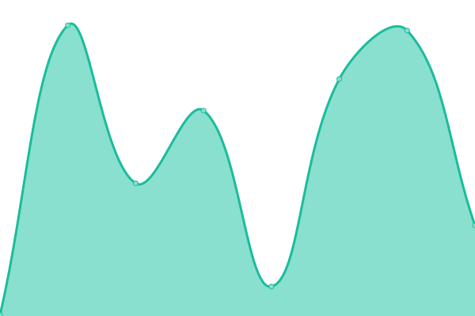

# [📈 实时状态](https://demo.upptime.js.org): <！ -实时状态- > **所有系统都可以正常运行**

This repository contains the open-source uptime monitor and status page for [Upptime](https://upptime.js.org), powered by [Upptime](https://github.com/upptime/upptime).

With [Upptime](https://upptime.js.org), you can get your own unlimited and free uptime monitor and status page, powered entirely by a GitHub repository. We use [Issues](https://github.com/upptime/upptime/issues) as incident reports, [Actions](https://github.com/upptime/xfxx2022/actions) as uptime monitors, and [Pages](https://demo.upptime.js.org) for the status page.

## [📈 Live Status](https://demo.upptime.js.org): <!--live status--> **🟧 部分停机**

<!--start: status pages-->
<!-- This summary is generated by Upptime (https://github.com/upptime/upptime) -->
<!-- Do not edit this manually, your changes will be overwritten -->
<!-- prettier-ignore -->
| 链接 | 状态 | 历史 | 响应时间 | 正常运行时间 |
| --- | ------ | ------- | ------------- | ------ |
|  [番茄酱的Blog](https://blog.aidengrong.top) | 🟩 正常运行 | [blog.yml](https://github.com/xfxx2022/Upptime/commits/HEAD/history/blog.yml) | 

 363毫秒
     
 | 

<a href="https://jiankong.aidengrong.top/history/blog">100.00%</a>
    

|  [corp](https://corp.top/zh) | 🟩 正常运行 | [corp.yml](https://github.com/xfxx2022/Upptime/commits/HEAD/history/corp.yml) | 

 1544毫秒
     
 | 

<a href="https://jiankong.aidengrong.top/history/corp">100.00%</a>
    

|  [Google](https://www.google.com) | 🟩 正常运行 | [google.yml](https://github.com/xfxx2022/Upptime/commits/HEAD/history/google.yml) | 

 85毫秒
     
 | 

<a href="https://jiankong.aidengrong.top/history/google">100.00%</a>
    

|  [Wikipedia](https://en.wikipedia.org) | 🟩 正常运行 | [wikipedia.yml](https://github.com/xfxx2022/Upptime/commits/HEAD/history/wikipedia.yml) | 

 185毫秒
     
 | 

<a href="https://jiankong.aidengrong.top/history/wikipedia">100.00%</a>
    

|  [Hacker News](https://news.ycombinator.com) | 🟩 正常运行 | [hacker-news.yml](https://github.com/xfxx2022/Upptime/commits/HEAD/history/hacker-news.yml) | 

 297毫秒
     
 | 

<a href="https://jiankong.aidengrong.top/history/hacker-news">100.00%</a>
    

|  [Test Broken Site](https://thissitedoesnotexist.koj.co) | 🟥 停机 | [test-broken-site.yml](https://github.com/xfxx2022/Upptime/commits/HEAD/history/test-broken-site.yml) | 

 0毫秒
     
 | 

<a href="https://jiankong.aidengrong.top/history/test-broken-site">100.00%</a>
    

<!--end: status pages-->

[**Visit our status website →**](https://demo.upptime.js.org)

## 📄 License

- Powered by: [Upptime](https://github.com/upptime/upptime)
- Code: [MIT](./LICENSE) © [Upptime](https://upptime.js.org)
- Data in the `./history` directory: [Open Database License](https://opendatacommons.org/licenses/odbl/1-0/)
